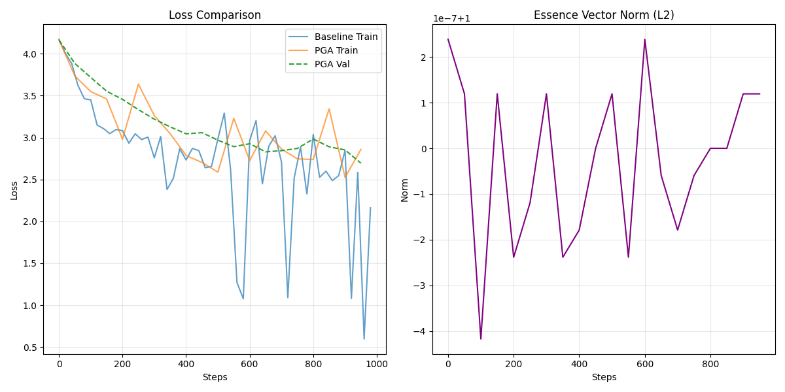

# PGA JIT Benchmark Report (v4-pga)

## Summary
Implements **Just-In-Time (JIT) Essence Recalculation**.
- **Mechanism**: Retrieves `tokens` -> Re-embeds with current model -> Computes $P$ -> Injects $P$ into Attention.
- **Dataset**: Shakespeare (1000 steps).

## Results

| Metric | Baseline | PGA JIT (Train) | PGA JIT (Val) |
| :--- | :--- | :--- | :--- |
| **Final Loss** | **2.16** | 2.86 | 2.69 |

## Analysis
1.  **Performance Regression**: PGA JIT performs **worse** than Baseline and even worse than v3-pga (2.24).
2.  **Essence Norm**: Stable at 1.00 (Normalized).
3.  **Projection Impact**: The additive residual `q = q + q @ P` seems to be disrupting the attention mechanism.
    -   It might be inflating the magnitude of $q$, pushing softmax into saturation?
    -   Or the "Principles" ($P$) derived from 16-token chunks are just noise, and adding noise to $Q$ hurts.

## Conclusion
JIT Recalculation works technically (no crashes, logic holds), but the **Fundamental Assumption** that "Top singular vector of a 16-token chunk contains useful principles for future prediction" is likely **flawed for this specific setup**.

## Recommendations
1.  **Learnable Gate**: Instead of `q + q@P`, use `q + tanh(alpha) * (q@P)` where `alpha` is a learned parameter initialized to 0. This lets the model *choose* to use P.
2.  **Context Size**: Rank-1 approximation of a 16-token chunk is extremely lossy. We might need larger chunks or full-rank retrieval.
