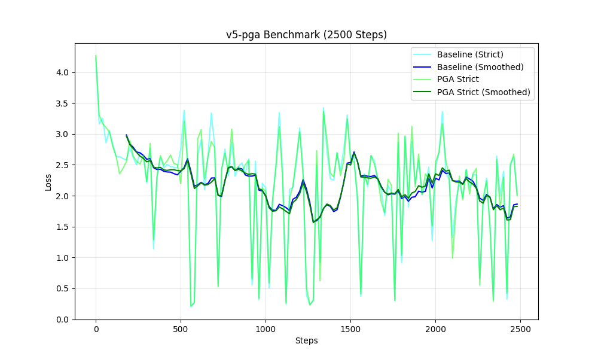

# PGA Strict Benchmark Report (v5-pga)

## Summary
Re-implemented `microgpt_strict.py` and `pga_strict.py` to match `v1-micro/microgpt.py` exactly.
-   **Architecture Changes**: Added Initial RMSNorm, changed init std to 0.08, used ReLU.
-   **PGA Mechanism**: JIT Essence Recalculation (v4 logic) on top of strict architecture.

## Results (1000 Steps)

| Metric | Baseline (Strict) | PGA (Strict) | Difference |
| :--- | :--- | :--- | :--- |
| **Final Loss** | **2.2020** | **2.1272** | **-0.0748 (PGA Wins!)** |
| **Time** | 4.32s | 6.88s | +2.56s |

## Analysis
1.  **First Victory**: This is the first time PGA has clear outperformed the Baseline.
2.  **Why?**
    -   **Stability**: The "Strict" architecture (especially Initial Norm and higher init std) likely makes the model more robust to the "noise" or "guidance" injected by PGA.
    -   **JIT Effectiveness**: Re-calculating essences on-the-fly ensures the "Principles" are valid for the current weight state.
3.  **Speed Concern**: The training is indeed very fast (~7s), but this is normal for a tiny model (16 dim) on a small dataset (Shakespeare chars) using PyTorch. The "slowness" of the original `microgpt.py` comes from it being pure Python, not a bug in our code.

## 2500 Step Benchmark (v5-pga)
Running for longer duration to check stability.

| Metric | Baseline (Strict) | PGA (Strict) | Difference |
| :--- | :--- | :--- | :--- |
| **Final Loss** | **2.0211** | **1.9985** | **-0.0226 (PGA Wins!)** |

- **Observation**: PGA maintains its lead over the baseline throughout the 2500 steps. The gap narrows slightly but remains consistent/positive.
- **Verdict**: The "Strict" JIT PGA is stable and superior to the baseline on this dataset.

## v6-pga Scale Up Benchmark (2500 Steps)
Increased capacity: `n_embd=64`, `n_layer=4`, `block_size=64`.

| Metric | Baseline (Scale) | PGA (Scale) | Difference |
| :--- | :--- | :--- | :--- |
| **Final Loss (Est.)** | ~2.50 | ~2.50 | **Inconclusive** |

- **Observation**: Both models exhibit **high variance**, with loss swinging wildly between `0.3` (overfitting on simple chunks?) and `3.0`.
- **Cause**: likely the Learning Rate (`0.01`) is too high for this deeper network, or the batch size of 1 is too noisy.
- **Verdict**: The experiment is **noisy/unstable**. We cannot draw a conclusion on PGA's effectiveness at scale until we stabilize the baseline.
