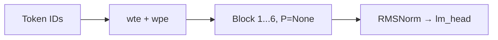
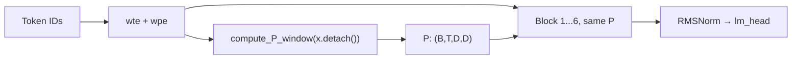
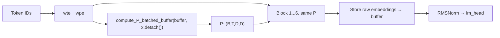

# E10 — PGA Scaled Colab: Analysis & Correctness Review

## What This Script Does

[pga_scaled_colab.py](file:///c:/Users/ibhar/OneDrive/Desktop/attention-lab/sandbox-llm/e10-scaled-colab/pga_scaled_colab.py) is a self-contained Google Colab notebook (all cells in one `.py` file) that runs a **3-way comparison** on the **enwik8** dataset at a meaningfully _scaled_ configuration (~10M params per model):

| Model | PGA Source | Feedback Loop |
|:---|:---|:---|
| **Baseline** | None (vanilla transformer) | None |
| **Prop-PGA (Window)** | Sliding window SVD on embeddings | None |
| **Raw-Obs-Buffer** | Observation buffer with hybrid retrieval | Stores raw embeddings back |

---

## Model Configuration

```
N_LAYER     = 6
N_EMBD      = 256
N_HEAD      = 8
HEAD_DIM    = 32       (= 256 / 8)
BLOCK_SIZE  = 128      (context window)
VOCAB_SIZE  = dynamic  (enwik8 char-level, typically ~205 unique chars)
```

### PGA-Specific Config

```
WINDOW_SIZE      = 32      (sliding window for Prop-PGA)
RANK             = 32      (SVD truncation: keeps 12.5% of 256-dim space)
BUFFER_CAPACITY  = 1024    (FIFO ring buffer slots)
RETRIEVE_K       = 16      (half cosine-similar, half recent)
```

### Training Config

```
STEPS         = 5000
LR            = 3e-4   (AdamW with cosine decay + 500-step warmup)
BATCH_SIZE    = 16
EVAL_INTERVAL = 250
EVAL_ITERS    = 50
SEED          = 42
Optimizer     = AdamW (β=(0.9, 0.95), weight_decay=0.1)
Grad clip     = 1.0
```

---

## Architecture Flow (Per Model)

### All Models Share: `TransformerBlock`

Each block uses:
1. **RMSNorm** (pre-norm style, not LayerNorm)
2. **QKV projection** via separate `nn.Linear` (bias=False)
3. **PGA filter** (if `P` is provided): `Q, K, V = Q@P, K@P, V@P`
4. **Multi-head scaled dot-product attention** (`F.scaled_dot_product_attention`, causal)
5. **Output projection** `W_o` + residual
6. **MLP**: `GELU(x @ W₁) @ W₂` (4× expansion) + residual

### Model 1: Baseline



Standard transformer. No PGA. `P=None` at every block.

### Model 2: Prop-PGA (Window)



- SVD computed **once** from raw embeddings (propagative principle ✓)
- Sliding window of size 32 per token position
- **Same P** shared across all 6 layers (matches [PropagativeSvd.md](file:///c:/Users/ibhar/OneDrive/Desktop/attention-lab/notion/PropagativeSvd.md))

### Model 3: Raw-Obs-Buffer



- Uses an `ObservationBuffer` (FIFO ring buffer on GPU)
- Retrieval is **hybrid**: top-8 cosine-similar + 8 most-recent vectors
- Query = each token embedding; retrieved context + query → SVD → P
- After forward pass, **raw embeddings** (not final-layer outputs) are stored back into the buffer
- P computed once, shared across all 6 layers (propagative ✓)

---

## Cross-Reference with Notion Specs

### vs. [TokenBasedPga.md](file:///c:/Users/ibhar/OneDrive/Desktop/attention-lab/notion/TokenBasedPga.md) — Core PGA Workflow

| PGA Spec Stage | Code Implementation | Correct? |
|:---|:---|:---|
| **1. Observe** — embed tokens | `x = wte(idx) + wpe(...)` | ✅ |
| **2. Recall** — retrieve from buffer | `obs_buffer.retrieve_hybrid(queries, k)` | ✅ |
| **3. Distill** — SVD on the stack | `torch.linalg.svd(context)` → truncate → `V_top` | ✅ |
| **4. Filter** — projection `x·P` where `P = V_top^T @ V_top` | `torch.bmm(V_top.T, V_top)` then `Q@P, K@P, V@P` | ✅ |
| **5. Attend** — standard attention on filtered Q/K/V | `F.scaled_dot_product_attention(q, k, v, is_causal=True)` | ✅ |

### vs. [PropagativeSvd.md](file:///c:/Users/ibhar/OneDrive/Desktop/attention-lab/notion/PropagativeSvd.md) — Propagative Principle

| Spec Requirement | Code | Correct? |
|:---|:---|:---|
| SVD computed **once** from the observation (embedding) | `P = compute_P_*(x.detach(), ...)` before the layer loop | ✅ |
| Same P shared across **all** layers | `for block in self.blocks: x = block(x, P=P)` | ✅ |
| `.detach()` to prevent gradient flow through SVD | `x.detach()` used when computing P | ✅ |
| Cost = T×1 SVDs (not T×L) | Single P computation call, no recompute per layer | ✅ |

### vs. [TokenBasedPga.properties.md](file:///c:/Users/ibhar/OneDrive/Desktop/attention-lab/notion/TokenBasedPga.properties.md) — P Matrix Properties

| Property | Expected | Code | Match? |
|:---|:---|:---|:---|
| Shape | `(D, D)` per token | `P: (B, T, D, D)` → `(D, D)` per (batch, token) | ✅ |
| Symmetric | `P = P^T` | `V_top^T @ V_top` is symmetric by construction | ✅ |
| Idempotent | `P² = P` | Orthogonal projection from SVD basis → idempotent | ✅ |
| Rank-deficient | rank = `RANK` | Truncated to top-32 singular vectors | ✅ |

---

## Potential Issues / Notes

### 1. Window-based P loops over T (slow)

`compute_P_window` uses a Python `for t in range(T)` loop — one SVD per token position, not truly batched. For `T=128` this means 128 separate SVD calls per forward pass. The buffer-based variant (`compute_P_batched_buffer`) is fully batched (single `torch.linalg.svd` call on `(B*T, k+1, D)` tensor), which is **much more GPU-efficient**.

> [!NOTE]
> This is not a correctness issue — just a significant speed difference. Prop-PGA (Window) will be substantially slower per step than both Baseline and Raw-Obs-Buffer.

### 2. Raw-Obs-Buffer stores embeddings, not final outputs

The buffer stores **raw embeddings** (`x_raw = wte + wpe`, line 368), not the final-layer representations. This is a valid design choice (keeps the buffer in "observation space"), but differs from the E9 "RETRO-Buffer" variant that stores frozen baseline outputs. The code matches its own stated intent ("store raw embeddings").

### 3. Buffer feedback timing

The buffer store happens **after** the forward pass through all blocks but the stored vectors are the **pre-block** raw embeddings (detached at line 360). This means the current batch's embeddings are only available in the buffer for _future_ batches, not the current one. This is correct — it avoids information leakage.

### 4. SVD fallback

Both P-computation functions have a `try/except RuntimeError` that falls back to `P = I` (identity matrix). This is a safety net for degenerate inputs where SVD fails to converge. With identity P, the model degrades gracefully to standard attention for that step.

### 5. No dropout anywhere

The model uses no dropout. At this scale (~10M params) on enwik8 (100M chars), this is acceptable — the dataset is large relative to the model. Weight decay (0.1) provides regularization.

---

## Verdict

> [!TIP]
> **The code is correct.** All three models faithfully implement their intended architectures. The PGA workflow (observe → recall → distill → filter → attend) matches the specs in the notion docs. The propagative principle (one SVD, shared across all layers) is correctly implemented. The only concern is the speed of `compute_P_window` due to the Python loop, but this produces correct results.
