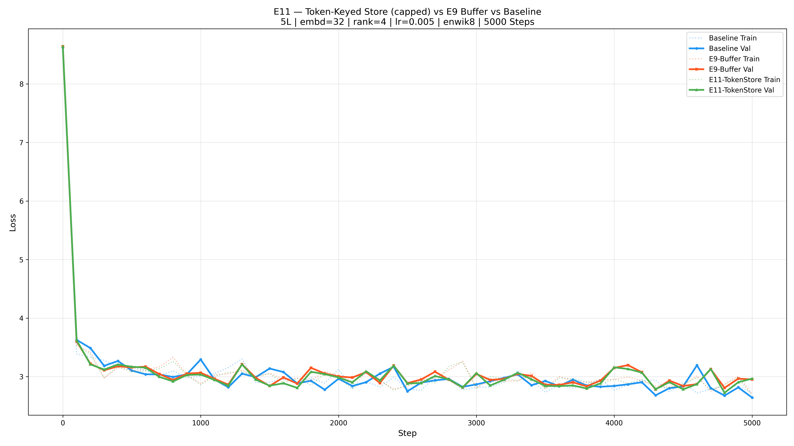

# E11 — Token-Keyed Store (capped) + Rank-4 PGA

> **Date**: 2026-02-20 18:17

## Configuration

| Setting | Value |
|---|---|
| Dataset | enwik8 (100MB) |
| Layers | 5 |
| n_embd | 32 |
| Steps | 5000 |
| LR | 0.005 |
| Batch Size | 1 |
| SVD Rank | 4 |
| Retrieve K | 8 |
| Store Cap | 10000/token |

## Models

| | Baseline | E9-Buffer | E11-TokenStore |
|---|---|---|---|
| Params | 450,048 | 451,072 | 451,072 |
| Buffer Type | — | FIFO ring (512) | Token-keyed dict (cap 10000/token) |
| SVD | — | Serial (16/step) | Batched (1 call/step) |
| Retrieval | — | 50/50 sim/recent | 70/30 sim/recent, same-token priority |
| Feedback | — | Final outputs | Final outputs (keyed by token_id) |
| Persistence | — | ❌ | ✅ token_store.pt |

## Results

| Metric | Baseline | E9-Buffer | E11-TokenStore |
|---|---|---|---|
| Train Loss | 2.7193 | 2.7053 | 2.6743 |
| Val Loss | 2.6433 | 2.9538 | 2.9671 |
| Gap | -0.0760 | 0.2485 | 0.2927 |
| Step Time | 19.8ms | 31.3ms | 119.3ms |
| Total | 125.4s | 228.0s | 1099.9s |

## Verdict

**Val Loss Winner: Baseline** (2.6433)
**Generalization Winner: Baseline** (gap: -0.0760)

