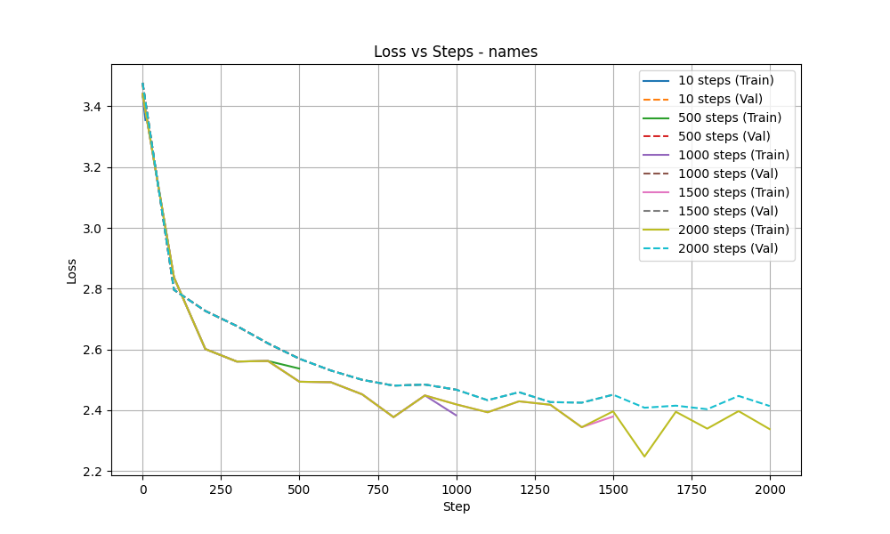
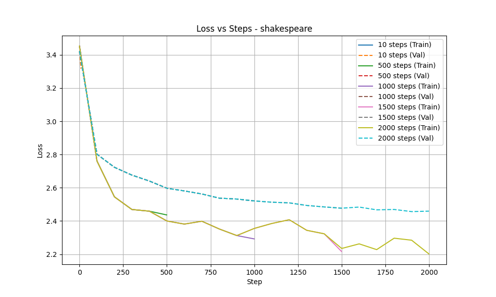

# PGA Token-Based Implementation: Verdict Report

Analysis of 10 experiment runs.

## Dataset: Names

| Steps | Final Train Loss | Final Val Loss | Overfitting? |
|-------|------------------|----------------|--------------|
| 10 | 3.3544 | 3.3795 | No |
| 500 | 2.5373 | 2.5702 | No |
| 1000 | 2.3838 | 2.4676 | No |
| 1500 | 2.3791 | 2.4511 | No |
| 2000 | 2.3379 | 2.4141 | No |

> [!NOTE]
> The model seems stable on **names**.

## Dataset: Shakespeare

| Steps | Final Train Loss | Final Val Loss | Overfitting? |
|-------|------------------|----------------|--------------|
| 10 | 3.3978 | 3.3167 | No |
| 500 | 2.4365 | 2.5980 | Yes |
| 1000 | 2.2924 | 2.5209 | Yes |
| 1500 | 2.2169 | 2.4770 | Yes |
| 2000 | 2.2018 | 2.4594 | Yes |

> [!CAUTION]
> The model shows signs of overfitting on **shakespeare** at longer training steps.
