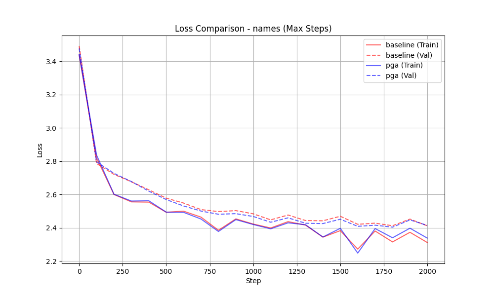
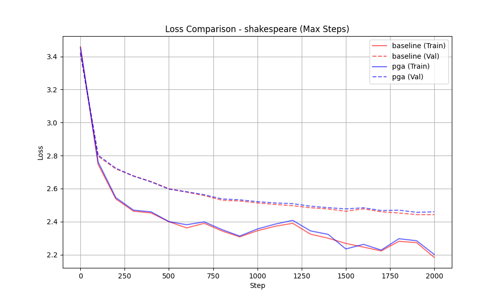

# Comparison: PGA vs Baseline

Analysis of 19 experiment runs.

## Dataset: Names

| Model | Steps | Final Train Loss | Final Val Loss | Overfitting? |
|-------|-------|------------------|----------------|--------------|
| baseline | 10 | 3.3458 | 3.3816 | No |
| baseline | 500 | 2.5237 | 2.5793 | No |
| baseline | 1000 | 2.3751 | 2.4841 | Yes |
| baseline | 1500 | 2.3740 | 2.4697 | No |
| baseline | 2000 | 2.3115 | 2.4115 | Yes |
| pga | 10 | 3.3544 | 3.3795 | No |
| pga | 500 | 2.5373 | 2.5702 | No |
| pga | 1000 | 2.3838 | 2.4676 | No |
| pga | 1500 | 2.3791 | 2.4511 | No |
| pga | 2000 | 2.3379 | 2.4141 | No |

## Dataset: Shakespeare

| Model | Steps | Final Train Loss | Final Val Loss | Overfitting? |
|-------|-------|------------------|----------------|--------------|
| baseline | 500 | 2.4395 | 2.6001 | Yes |
| baseline | 1000 | 2.2904 | 2.5135 | Yes |
| baseline | 1500 | 2.2198 | 2.4631 | Yes |
| baseline | 2000 | 2.1838 | 2.4422 | Yes |
| pga | 10 | 3.3978 | 3.3167 | No |
| pga | 500 | 2.4365 | 2.5980 | Yes |
| pga | 1000 | 2.2924 | 2.5209 | Yes |
| pga | 1500 | 2.2169 | 2.4770 | Yes |
| pga | 2000 | 2.2018 | 2.4594 | Yes |
