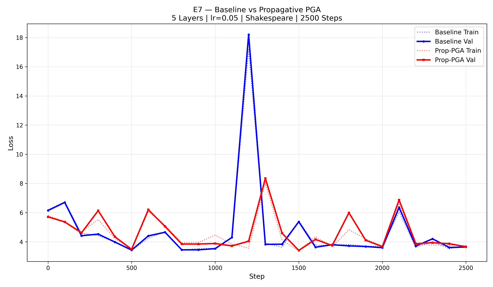

# E7 — Propagative PGA Experiment Report

> **Date**: 2026-02-20 06:41

## Configuration

| Setting | Value |
|---|---|
| Dataset | Shakespeare (Tiny) |
| Layers | 5 |
| n_embd | 16 |
| n_head | 4 |
| block_size | 16 |
| Vocab Size | 65 |
| Learning Rate | 0.05 |
| Steps | 2500 |
| Batch Size | 1 |
| Optimizer | Adam (betas=0.85/0.99) |
| PGA Window | 8 |
| PGA Rank | 8 |
| Execution | Parallel (2 processes) |

## Model Specs

| | Baseline | Propagative PGA |
|---|---|---|
| Parameters | 17,696 | 17,696 |
| Extra Learnable Params | — | 0 (SVD is compute-only) |
| SVD calls/forward | 0 | T=16 (once from embeddings) |
| P reuse | — | Same P across all 5 layers |

## Results

| Metric | Baseline | Propagative PGA | Delta |
|---|---|---|---|
| Final Train Loss | 3.6792 | 3.7440 | 0.0648 |
| Final Val Loss | 3.6443 | 3.6608 | 0.0165 |
| Overfitting Gap | -0.0349 | -0.0832 | -0.0483 |
| Avg Step Time | 7.1ms | 8.5ms | 1.4ms |
| Total Time | 22.2s | 28.2s | — |

## Verdict

**Winner: Baseline**

- **Loss**: ❌ Baseline achieved lower validation loss — Baseline wins.
- **Generalization**: Propagative PGA generalizes better (smaller train-val gap).
- **Speed**: Prop-PGA was 1.27× slower than Baseline.

## Propagative Nature

The key innovation tested: SVD is computed **once per token from the embedding layer**, and the resulting projection matrix P is **reused identically across all 5 layers**. This means:

- The "principle" is a property of the **observation**, not the intermediate computation
- SVD cost = T (not T × L) — **5× compute savings** vs full per-layer PGA
- No extra parameters — PGA is pure compute overhead

