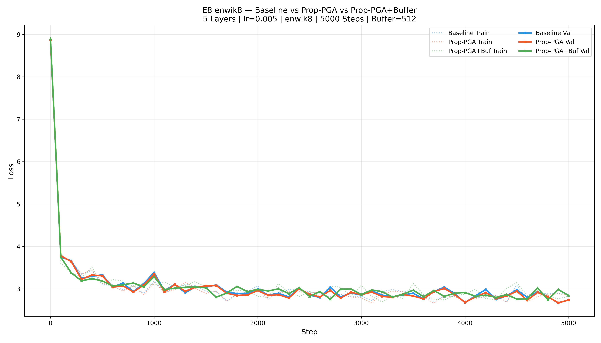

# E8 — Propagative PGA + Observation Buffer Report (enwik8)

> **Date**: 2026-02-20 07:29

## Configuration

| Setting | Value |
|---|---|
| Dataset | **enwik8** (100MB Wikipedia XML) |
| Layers | 5 |
| n_embd | 16 |
| n_head | 4 |
| block_size | 16 |
| Vocab Size | 6064 |
| Learning Rate | 0.005 |
| Steps | 5000 |
| Batch Size | 1 |
| Optimizer | Adam (betas=0.85/0.99) |
| PGA Window | 8 |
| PGA Rank | 8 |
| Buffer Capacity | 512 |
| Buffer Retrieve K | 8 |
| Execution | Parallel (3 processes) |

## Model Specs

| | Baseline | Prop-PGA (Window) | Prop-PGA+Buffer |
|---|---|---|---|
| Parameters | 209,664 | 209,664 | 209,920 |
| Extra Learnable | — | 0 | 256 (query_proj) |
| SVD source | — | Sliding window (8) | Buffer retrieval (8) |
| P reuse | — | All 5 layers | All 5 layers |
| Persistent memory | — | ❌ | ✅ (512 capacity) |
| Feedback loop | — | ❌ | ✅ (stores essence vectors) |

## Results

| Metric | Baseline | Prop-PGA | Prop-PGA+Buf |
|---|---|---|---|
| Final Train Loss | 2.8760 | 2.8486 | 2.8287 |
| Final Val Loss | 2.7419 | 2.7380 | 2.8409 |
| Overfit Gap | -0.1341 | -0.1106 | 0.0123 |
| Avg Step Time | 10.2ms | 11.7ms | 16.3ms |
| Total Time | 64.7s | 77.4s | 110.6s |

## Verdict

**Loss Winner: Prop-PGA** (lowest validation loss)
**Generalization Winner: Prop-PGA+Buf** (smallest overfit gap)

## Dataset Notes

enwik8 is ~90× larger than TinyShakespeare with ~3× more unique characters.
This tests whether the observation buffer provides genuine retrieval value
rather than memorizing the training set.

