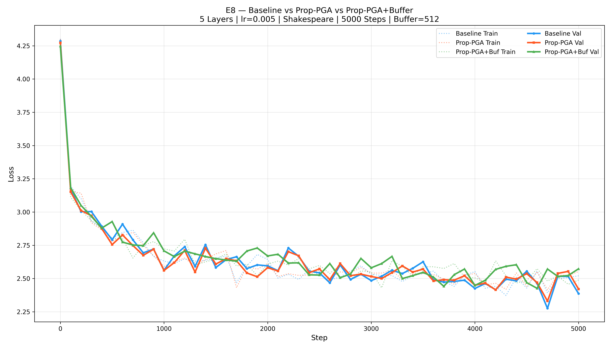

# E8 — Propagative PGA + Observation Buffer Report

> **Date**: 2026-02-20 07:20

## Configuration

| Setting | Value |
|---|---|
| Dataset | Shakespeare (Tiny) |
| Layers | 5 |
| n_embd | 16 |
| n_head | 4 |
| block_size | 16 |
| Vocab Size | 65 |
| Learning Rate | 0.005 |
| Steps | 5000 |
| Batch Size | 1 |
| Optimizer | Adam (betas=0.85/0.99) |
| PGA Window | 8 |
| PGA Rank | 8 |
| Buffer Capacity | 512 |
| Buffer Retrieve K | 8 |
| Execution | Parallel (3 processes) |

## Model Specs

| | Baseline | Prop-PGA (Window) | Prop-PGA+Buffer |
|---|---|---|---|
| Parameters | 17,696 | 17,696 | 17,952 |
| Extra Learnable | — | 0 | 0 |
| SVD source | — | Sliding window (8) | Buffer retrieval (8) |
| P reuse | — | All 5 layers | All 5 layers |
| Persistent memory | — | ❌ | ✅ (512 capacity) |
| Feedback loop | — | ❌ | ✅ (stores essence vectors) |

## Results

| Metric | Baseline | Prop-PGA | Prop-PGA+Buf |
|---|---|---|---|
| Final Train Loss | 2.5204 | 2.5525 | 2.4888 |
| Final Val Loss | 2.3864 | 2.4209 | 2.5731 |
| Overfit Gap | -0.1340 | -0.1316 | 0.0843 |
| Avg Step Time | 9.1ms | 10.5ms | 15.1ms |
| Total Time | 57.8s | 70.3s | 103.0s |

## Verdict

**Loss Winner: Baseline** (lowest validation loss)
**Generalization Winner: Prop-PGA+Buf** (smallest overfit gap)

## Architecture Notes

### Prop-PGA (Window) — Same as e7
- SVD computed from sliding window of 8 adjacent embeddings
- No cross-sequence memory

### Prop-PGA+Buffer — NEW in e8
- **Observation Buffer**: FIFO ring buffer of 512 vectors
- **Hybrid Retrieval**: half cosine-similar + half recent vectors
- **SVD on retrieved context**: principle derived from semantically relevant history
- **Feedback Loop**: final-layer representations stored back into buffer
- **Propagative**: Same P across all 5 layers (compute once from embeddings)

