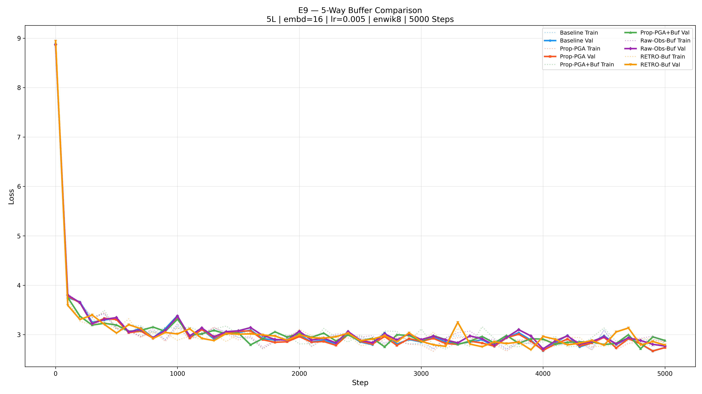

# E9 — RETRO vs Feedback Buffer — 5-Way Comparison

> **Date**: 2026-02-20 07:58

## Configuration

| Setting | Value |
|---|---|
| Dataset | enwik8 (100MB) |
| Layers | 5 |
| n_embd | 16 |
| Steps | 5000 |
| LR | 0.005 |
| Buffer | 512 capacity, k=8 |
| RETRO prefill | 512 batches |

## Models

| | Baseline | Prop-PGA | Prop-PGA+Buf | Raw-Obs-Buf | RETRO-Buf |
|---|---|---|---|---|---|
| Params | 209,664 | 209,664 | 209,920 | 209,664 | 209,920 |
| SVD src | — | Window | Buffer (final) | Buffer (raw) | Buffer (frozen) |
| Feedback | — | — | ✅ Final outputs | ✅ Raw embeddings | ❌ Frozen |
| query_proj | — | — | ✅ | ❌ | ✅ |

## Results

| Metric | Baseline | Prop-PGA | Prop-PGA+Buf | Raw-Obs-Buf | RETRO-Buf |
|---|---|---|---|---|---|
| Train Loss | 2.8760 | 2.8486 | 2.8543 | 2.8591 | 2.8467 |
| Val Loss | 2.7419 | 2.7380 | 2.8822 | 2.7690 | 2.7896 |
| Gap | -0.1341 | -0.1106 | 0.0278 | -0.0900 | -0.0571 |
| Step Time | 16.3ms | 20.8ms | 25.6ms | 25.5ms | 18.7ms |
| Total | 103.6s | 138.8s | 185.8s | 185.2s | 138.1s |

## Verdict

**Val Loss Winner: Prop-PGA** (2.7380)
**Generalization Winner: Prop-PGA+Buf** (gap: 0.0278)

